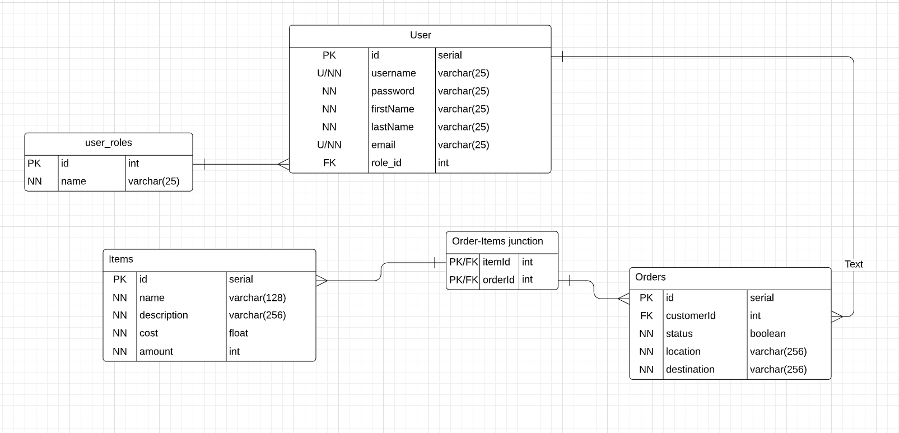

The purpose of this project is to create a basic online ordering system API, incorporating TypeScript, PostGreSQL, node-postgre, express, jest, and Git SCM. The primary functionality of this API is to create, read, update, and delete data from a database created in PostGreSQL, hosted by AWS. The method used to interface with the API is HTTP. In this project, there are three data types: Users, Items, and Orders. Each user is to have 0-n orders, and each order is to have 1-n items.

[POST] /auth : Authenticates user

[GET] /users : Gets all users \n
[GET] /users/:id : Gets user :id \n
[GET] /users/:id/orders : Gets all the users orders with the specified :id
[POST] /users : Posts a user given a JSON with user properties
[DELETE] /users/:id : Deletes a user with serial :id
[PATCH] /users/:id : Patches a user given a JSON with user properties

[GET] /orders : Gets all orders
[GET] /orders/:id : Gets order :id
[GET] /orders/:id/items : Gets all items at the order :id
[POST] /orders/:id : Posts an order at :id given a JSON with order properties
[PATCH] /orders/:id : Patches an order at :id given a JSON with order properties
[DELETE] /orders/:id : Deletes an order at :id

[GET] /items : Gets all items
[GET] /items/:id Gets item :id
[POST] /items/:id : Posts item at :id given a JSON with item properties
[PATCH] /items/:id : Patches an item at :id given a JSON with item properties
[DELETE] /items/:id : Deletes an item given :id

